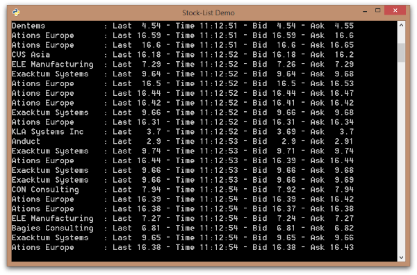

# Lightstreamer - Basic Stock-List Demo - C++ Client

This project contains an example of a C++ application that employs the **Lightstreamer C++ Client library**.



## Details

The example provides a very simple version of the [Stock-List Demos](https://github.com/Lightstreamer/Lightstreamer-example-Stocklist-client-javascript), where a single subscription to 12 items is submitted.
The updates are then formatted and displayed on the console.
  
The script shows all the basic steps required to establish an interaction to Lightstreamer Server. More specifically, the code comprises these actions: 

* Connection to Lightstreamer server and session creation
* Subscription to items with specified fields
* Notification about real time updates
* Unsubscription from items
* Final disconnection 

## Building

* To build this demo, first install [CMake](https://cmake.org).
* Clone the project [Lightstreamer C++ Client library](https://github.com/Lightstreamer/Lightstreamer-lib-client-haxe)
* Following these [instructions](https://github.com/Lightstreamer/Lightstreamer-lib-client-haxe#cpp), build the *statically linked* version (with debug symbols) of the Lightstreamer Client SDK.
* Write down the *full path* to the folder containing the generated C++ source files and binaries (e.g. `~/git/lib-client-haxe/bin/cpp/mac/static-debug`).

You can now build the demo executing the following commands:

```sh
mkdir build
cd build
cmake .. -DLIGHTSTREAMER_BASE_DIR=<path-to-Lightstreamer-library>
cmake --build .
```

If you want to install a version of this demo pointing to your local Lightstreamer Server, follow these steps:

* As prerequisite, the [Lightstreamer - Stock- List Demo - Java Adapter](https://github.com/Lightstreamer/Lightstreamer-example-Stocklist-adapter-java) has to be deployed on your local Lightstreamer Server instance. Please check out that project and follow the installation instructions provided with it.
* Launch Lightstreamer Server.

To start the demo, run the executable `build/StockListDemo`.

**Notes**:

- The CMake script is set up to link the demo against the *debug* version of the Lightstreamer *static* library. If you need a different configuration, modify the `CMakeLists.txt` file accordingly. 
	
- The demo is configured to connect to http://push.lightstreamer.com:80, but you can easily change these settings modifying this line
`LightstreamerClient client("https://push.lightstreamer.com","DEMO");` (in the file `src/stock_list_demo.cpp`) to connect to the correct combination of host and port of your Lightstreamer server.

### Lightstreamer Adapters Needed by this Demo Client

* [Lightstreamer - Stock- List Demo - Java Adapter](https://github.com/Lightstreamer/Lightstreamer-example-Stocklist-adapter-java)

### Related Projects

* [Demos](https://demos.lightstreamer.com)
* [Lightstreamer C++ Client library](https://github.com/Lightstreamer/Lightstreamer-lib-client-haxe)
* [Lightstreamer - Stock-List Demos - HTML Clients](https://github.com/Lightstreamer/Lightstreamer-example-Stocklist-client-javascript)
* [Lightstreamer - Stock-List Demos - Python Client](https://github.com/Lightstreamer/Lightstreamer-example-Stocklist-client-python)
* [Lightstreamer - Basic Stock-List Demo - Java SE (Swing) Client](https://github.com/Lightstreamer/Lightstreamer-example-StockList-client-java)
* [Lightstreamer - Basic Stock-List Demo - .NET Client](https://github.com/Lightstreamer/Lightstreamer-example-StockList-client-dotnet)
* [Lightstreamer - Basic Stock-List Demo - Swift Client](https://github.com/Lightstreamer/Lightstreamer-example-StockList-client-osx)

## Lightstreamer Compatibility Notes

* Compatible with Lightstreamer C++ Client SDK 1.0 or newer.
* Compatible with Lightstreamer Server 7.4.0 or newer.